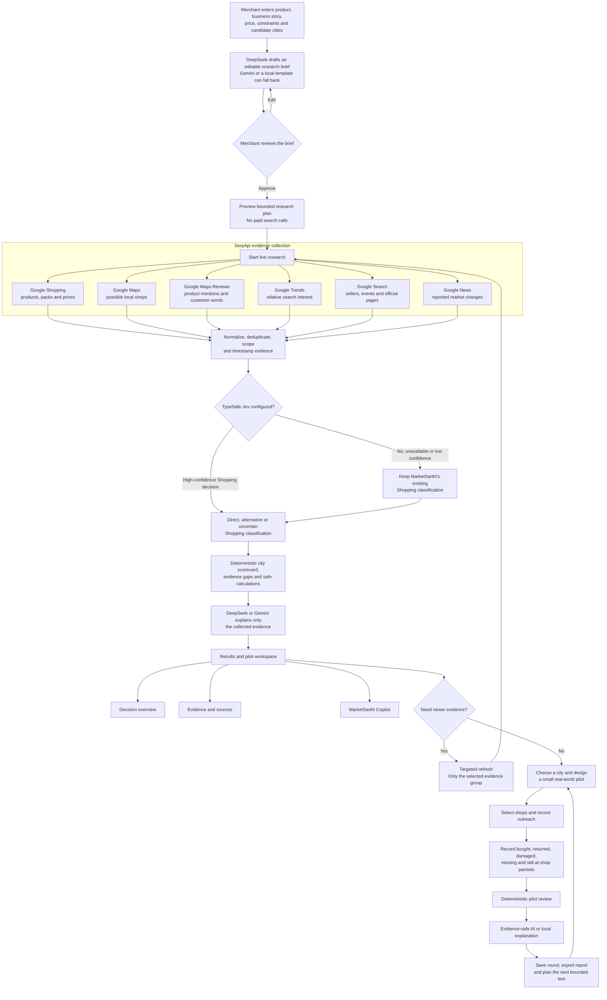
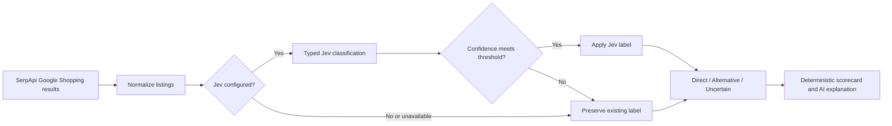
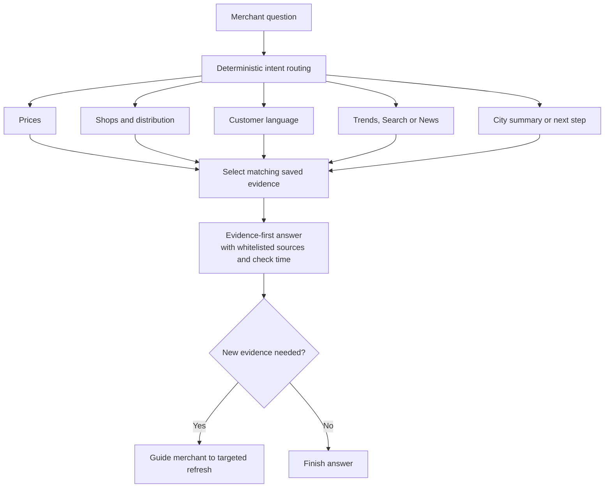
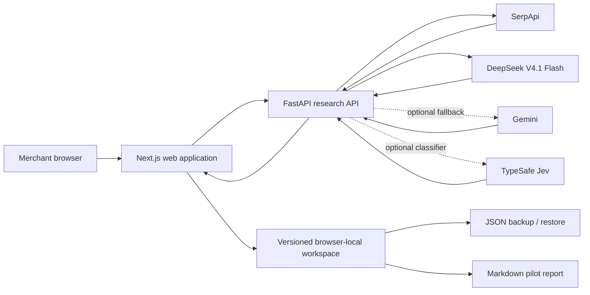

<div align="center">

# 🚀 MarketSarthi

### Evidence-first regional expansion copilot for Indian MSMEs and D2C brands

**Research → Compare → Verify → Pilot → Measure → Learn**


Built for the **SerpApi India Hackathon 2026**.

</div>

> [!IMPORTANT]
> MarketSarthi does not predict guaranteed demand, sales or market success. It organizes public search signals, exposes uncertainty and helps a merchant design the next bounded real-world test.

## Table of contents

- [What is MarketSarthi?](#what-is-marketsarthi)
- [Why MarketSarthi?](#why-marketsarthi)
- [Complete product workflow](#complete-product-workflow)
- [Evidence sources](#evidence-sources)
- [Hybrid Jev classification](#hybrid-jev-classification)
- [Evidence safety contract](#evidence-safety-contract)
- [Small real-world pilot](#small-real-world-pilot)
- [MarketSarthi Copilot](#marketsarthi-copilot)
- [Technical architecture](#technical-architecture)
- [Technology stack](#technology-stack)
- [Run MarketSarthi locally](#run-marketsarthi-locally)
- [Judge and demo flow](#judge-and-demo-flow)
- [Verification](#verification)
- [Security](#security)
- [Current limitations](#current-limitations)
- [Documentation](#documentation)

## What is MarketSarthi?

MarketSarthi helps a small merchant investigate expansion into one or more new cities without pretending that search visibility is proof of demand.

The merchant provides:

- Product and category
- Current market and candidate cities
- Price range and pack size
- Product differentiators
- Business constraints
- Business background and expansion goal

MarketSarthi then:

1. Creates an editable AI research brief.
2. Lets the merchant review and approve the context.
3. Previews a bounded research plan before paid searches begin.
4. Collects live, source-linked evidence through SerpApi.
5. Normalizes, deduplicates, scopes and timestamps observations.
6. Optionally uses TypeSafe Jev for confidence-gated Shopping classification.
7. Applies deterministic rules before AI explanation.
8. Produces a transparent decision overview with evidence gaps.
9. Helps the merchant plan and measure a small shop pilot.
10. Saves pilot rounds and supports the next bounded experiment.

## Why MarketSarthi?

Traditional market research can be expensive and difficult for small businesses. Searching manually also creates a second problem: isolated search results are easy to overinterpret.

MarketSarthi uses a safer loop:

```text
Collect evidence
      ↓
Separate what is observed from what is assumed
      ↓
Expose missing and conflicting information
      ↓
Run a small real-world test
      ↓
Measure what actually happened
      ↓
Choose the next experiment
```

> **AI explains evidence. It does not guarantee success.**

## Complete product workflow



## Evidence sources

MarketSarthi currently uses six SerpApi surfaces:

| SerpApi surface | What MarketSarthi observes | What it does **not** prove |
|---|---|---|
| Google Shopping | Visible products, brands, prices, packs, sellers and positioning | City demand, future sales or local availability |
| Google Maps | Possible local retailers and test channels | Product stock, retailer interest or partnership |
| Google Maps Reviews | Product-specific mentions and bounded customer language | Current inventory or city-wide sentiment |
| Google Trends | Relative interest over time and returned city comparison | Search volume, buyers, revenue or demand |
| Google Search | Sellers, distributors, brand pages, events, associations and schemes | Accuracy, official status or commercial success |
| Google News | Reported market, retail, policy, event and supply changes | Business impact, sentiment or future performance |

Every evidence item has one explicit scope:

- `city_local` — the returned observation clearly names the candidate city.
- `india_wide_online` — an online or India-wide signal that must not be presented as local evidence.
- `business_review` — a review observation tied to one named business.

## Hybrid Jev classification

TypeSafe Jev is an optional fast classifier inside the Shopping evidence pipeline. It does not replace SerpApi, DeepSeek or Gemini.



Jev:

- Classifies normalized Google Shopping evidence only.
- Returns typed decisions with confidence.
- Uses a configurable confidence threshold (`0.65` by default).
- Fails back safely when unavailable, invalid or uncertain.
- Does not search the web or alter retrieved prices.
- Does not classify Maps, Reviews, Trends, Search or News.
- Does not decide whether a merchant should enter a city.

## Evidence safety contract

MarketSarthi follows these product rules:

- Never promise that a product or city will succeed.
- Keep merchant-provided facts separate from external evidence.
- Attach a source when one is available.
- Separate direct products, alternatives and uncertain matches.
- Treat Maps businesses as possible channels—not competitors or confirmed partners.
- Call a Maps lead product-mentioned only when a product-filtered review returns a match.
- Treat review language as a named-business observation, not city-wide sentiment.
- Display failed and empty searches instead of hiding them.
- Treat evidence coverage as research completeness, not market potential.
- Recommend a bounded pilot before large production or distribution commitments.

## Deterministic city evidence scorecard

Research coverage uses six transparent checks:

1. At least three same-product listings.
2. At least one usable same-product price.
3. At least five local shops to check.
4. At least one shop with a product-specific review mention.
5. At least one city-specific web result.
6. A returned Google Trends row for the candidate city.

The coverage percentage reports how many research checks were completed. It is **not** a demand score, market ranking or probability of success.

## Small real-world pilot

After research, the merchant chooses a researched city and controls:

- Test duration
- Planned quantity
- Number of participating shops
- Test price
- Target percentage bought
- Maximum acceptable return percentage
- Optional maximum test loss

### Shop workflow

```text
Possible shop to contact
        ↓
Not contacted
        ↓
Contacted — waiting for reply
        ↓
Interested — discussing terms
        ↓
Confirmed for this pilot / Not participating
```

A confirmed shop means only that the merchant recorded agreement for this bounded test. It does not mean permanent distribution or proven demand.

### Stock reconciliation

Every packet must be accounted for:

```text
Packets given = Bought + Returned + Damaged + Missing + Still at shops
```

MarketSarthi calculates:

```text
Percentage bought   = Packets bought ÷ Actual packets given × 100
Percentage returned = Packets returned ÷ Actual packets given × 100
```

The deterministic pilot outcome is one of:

| Outcome | Meaning |
|---|---|
| `continue_small_test` | Merchant-defined checks were met and at least one shop requested another batch |
| `modify_and_retest` | Some checks were met, damage was recorded, or the optional money limit was exceeded |
| `investigate_before_next_test` | Stock is incomplete, totals conflict, or the signals need investigation |
| `stop_and_review` | Defined checks were not met and stock data is complete |

These are experiment-management outcomes—not market-success predictions.

## MarketSarthi Copilot

The Copilot answers from the current saved workspace. It does not automatically launch a paid search.



The Copilot can explain saved prices, city comparisons, shops, review observations, Trends, web pages, news, evidence gaps and next steps. It cannot click controls, modify merchant data or claim that old evidence is current.

## Technical architecture



### Trust boundary

- API keys remain in the backend `.env` file.
- The browser receives evidence and model outputs, never provider keys.
- Workspace autosave is browser-local and does not synchronize across devices.
- Backup files can contain merchant context and must be treated as private.

## Technology stack

| Layer | Technology | Responsibility |
|---|---|---|
| Web | Next.js, React, TypeScript, CSS | Merchant inputs, evidence views, Copilot, pilot tracking and local persistence |
| API | FastAPI, Python 3.11+, Pydantic, HTTPX | Validation, research orchestration, normalization and deterministic calculations |
| Search evidence | SerpApi | Shopping, Maps, Maps Reviews, Trends, Search and News |
| Primary LLM | DeepSeek V4.1 Flash | Briefs and evidence-bound explanations in non-thinking JSON mode |
| Optional fallback | Gemini | Structured generation when the primary provider is unavailable |
| Optional classifier | TypeSafe Jev | Confidence-gated Shopping classification |
| Tooling | `uv`, npm, Ruff, pytest, ESLint | Reproducible setup, tests and quality checks |

## Repository structure

```text
MarketSarthi/
├── apps/
│   ├── api/
│   │   ├── app/
│   │   │   ├── core/              # Configuration
│   │   │   ├── routers/           # Health and research endpoints
│   │   │   ├── schemas/           # Pydantic request/response contracts
│   │   │   └── services/          # Research, providers, Copilot and pilot review
│   │   ├── scripts/               # Integration smoke checks
│   │   ├── tests/                 # Backend test suite
│   │   ├── pyproject.toml
│   │   └── uv.lock
│   └── web/
│       ├── app/
│       │   ├── page.tsx           # Complete merchant workflow
│       │   └── globals.css        # Visual system and responsive layout
│       ├── package.json
│       └── package-lock.json
├── docs/
│   ├── ARCHITECTURE.md
│   └── DAY_01.md
├── .env.example
├── .vscode/tasks.json
├── AGENTS.md
├── PROJECT_CONTEXT.md
├── package.json
└── README.md
```

## API endpoints

| Method | Endpoint | Purpose |
|---|---|---|
| `POST` | `/api/v1/research/brief` | Create an editable research brief |
| `POST` | `/api/v1/research/preview` | Create a bounded plan without paid research calls |
| `POST` | `/api/v1/research/analyze` | Run the approved live research plan |
| `POST` | `/api/v1/research/refresh` | Refresh selected evidence groups while preserving the workspace |
| `POST` | `/api/v1/research/decision-summary` | Create the four-part final decision summary |
| `POST` | `/api/v1/research/copilot` | Answer from supplied saved-workspace evidence |
| `POST` | `/api/v1/research/pilot-review` | Calculate and explain a deterministic pilot outcome |
| `GET` | `/api/v1/health/live` | Basic API health |
| `GET` | `/api/v1/health/ready` | Provider configuration readiness |

## Run MarketSarthi locally

### Prerequisites

- Python 3.11 or newer
- [`uv`](https://docs.astral.sh/uv/)
- Node.js and npm
- VS Code recommended on Windows

### 1. Configure environment variables

Copy `.env.example` to `.env` from PowerShell:

```powershell
Copy-Item .env.example .env
```

Add your own provider keys to `.env`:

```dotenv
# Required for full live research
SERPAPI_KEY=
DEEPSEEK_API_KEY=

# Optional providers
GEMINI_API_KEY=
TYPESAFE_API_KEY=
```

> [!CAUTION]
> Never commit `.env`, paste real keys into documentation, or put secret values in `apps/web`. Never use a `NEXT_PUBLIC_` variable for a provider secret.

### 2. Install dependencies

```powershell
uv --cache-dir apps/api/.uv-cache sync --project apps/api --extra dev
npm --prefix apps/web install
```

### 3. Start the API

```powershell
npm run dev:api
```

### 4. Start the web application

Open a second terminal:

```powershell
npm run dev:web
```

Open:

- Web application: <http://localhost:3000>
- FastAPI documentation: <http://localhost:8000/docs>

## Quick start with VS Code on Windows

1. Open the repository root—not only `apps/web` or `apps/api`.
2. Press <kbd>Ctrl</kbd> + <kbd>Shift</kbd> + <kbd>P</kbd>.
3. Select **Tasks: Run Task**.
4. Select **MarketSarthi: Start Full Stack**.
5. Open <http://localhost:3000>.

Available tasks:

- `MarketSarthi: Start API`
- `MarketSarthi: Start Web`
- `MarketSarthi: Start Full Stack`
- `MarketSarthi: Test API`
- `MarketSarthi: Build Web`

## Environment variables

| Variable | Required? | Purpose |
|---|---|---|
| `SERPAPI_KEY` | Yes for live research | SerpApi evidence collection |
| `DEEPSEEK_API_KEY` | Yes for the default AI path | Primary brief and synthesis provider |
| `LLM_PROVIDER` | No | Primary provider name; defaults to `deepseek` |
| `LLM_FALLBACK_PROVIDER` | No | Optional fallback; defaults to `gemini` |
| `GEMINI_API_KEY` | No | Gemini fallback provider |
| `TYPESAFE_API_KEY` | No | Enables optional Jev Shopping classification |
| `JEV_CLASSIFICATION_MIN_CONFIDENCE` | No | Jev acceptance threshold; defaults to `0.65` |
| `SERPAPI_CACHE_TTL_SECONDS` | No | Process-local successful-response cache lifetime |
| `SERPAPI_CACHE_MAX_ENTRIES` | No | Maximum process-local cache entries |
| `REQUEST_TIMEOUT_SECONDS` | No | External request timeout |
| `FRONTEND_URL` | No | Allowed frontend origin for local API access |

See [`.env.example`](.env.example) for the complete safe configuration template.

## Judge and demo flow

For a short functionality demonstration:

1. Enter merchant and product details.
2. Generate, edit and approve the research brief.
3. Preview the bounded research plan.
4. Start live research.
5. Show the SerpApi engines, tool trace and source-linked evidence.
6. Explain direct products, alternatives and possible retail channels.
7. Open the city scorecard and final decision summary.
8. Ask the Copilot one evidence question.
9. Open **Plan a small test**.
10. Select a shop, record outreach and demonstrate pilot measurement.
11. Show the deterministic pilot outcome and downloadable report.

> [!TIP]
> The SerpApi India Hackathon requires a public repository and a public or unlisted demo video under three minutes. A public hosted deployment is not required; verify the current official rules before submission.

## Verification

Run the complete quality checks from the repository root:

```powershell
npm run test:api
npm run lint:api
npm run lint:web
npm run build:web
```

If a running Windows preview or OneDrive locks the normal `.next` directory:

```powershell
$env:MARKETSARTHI_NEXT_DIST_DIR = ".next-build-check"
npm run build:web
```

## Security

- Never commit `.env`.
- Never place SerpApi, DeepSeek, Gemini or TypeSafe keys in frontend code.
- Never prefix provider secrets with `NEXT_PUBLIC_`.
- `.env.example` contains variable names and safe defaults only.
- Browser workspace backups never contain API keys.
- Restore rejects common secret-like fields and unsafe URL protocols.
- Merchant business notes, retailer outreach and pilot results are private workspace data.
- Rotate any credential immediately if it is accidentally exposed.

Before publishing, inspect the staged files and repository history for credentials—not only the latest working tree.

## Current limitations

- Maps review mentions can be old and do not prove current stock.
- Search availability varies by query, location and time.
- Google Trends values are relative; they are not searches, customers, sales or demand.
- Search snippets can be incomplete or stale.
- News results can be loosely related, duplicated or older than expected.
- The SerpApi cache is process-local and not shared across deployed workers.
- Authentication and server/database persistence are not currently active.
- Workspace persistence is browser-local and does not synchronize across devices.
- Pilot measurements depend on merchant-entered observations.
- The optional money check is a test-level cash snapshot, not accounting profit, ROI or margin.
- Copilot history is browser-local and limited to the current workspace.
- Jev currently classifies Google Shopping evidence only.
- Jev does not reduce SerpApi retrieval time.
- Jev accuracy and its confidence threshold still require evaluation on labelled MarketSarthi examples.
- Evidence coverage must never be reused as a demand or market-potential score.

## Documentation

| Document | Purpose |
|---|---|
| [`PROJECT_CONTEXT.md`](PROJECT_CONTEXT.md) | Living product and technical source of truth, limitations and change log |
| [`docs/ARCHITECTURE.md`](docs/ARCHITECTURE.md) | Compact data flow, trust boundaries and integration architecture |
| [`docs/DAY_01.md`](docs/DAY_01.md) | Historical foundation plan and first vertical slice |
| [`AGENTS.md`](AGENTS.md) | Repository instructions for coding assistants |

## Project philosophy

> **Evidence first. Deterministic where facts matter. AI where explanation helps. Small experiments before large commitments.**

<div align="center">

### Research with evidence. Test with discipline. Learn from reality.

Built by **Vishv Pandya**

Generative AI • Agentic AI • Market Research • Evidence-Based Decision Systems

</div>
